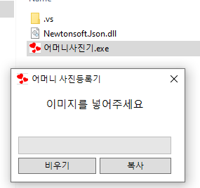
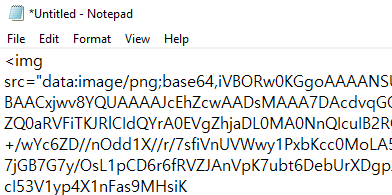
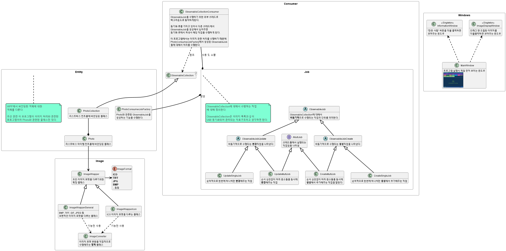
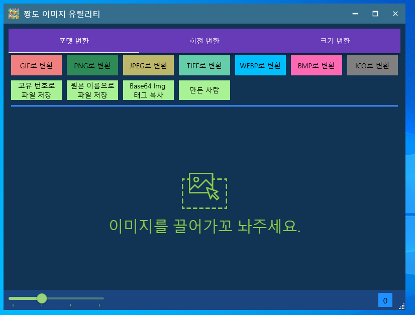
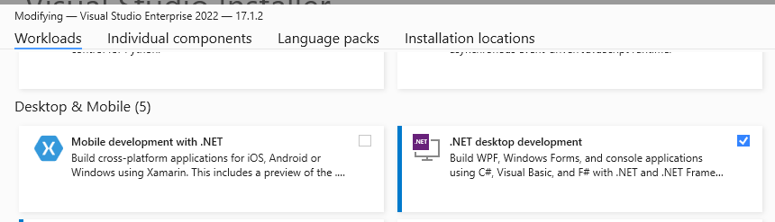

### 목차
 * [시작 배경](#start_background)
 * [클래스 구조](#class_structure)
 * [기능](#functionality)
 * [사용 방법](#how_to_use)
 * [빌드 방법](#how_to_build)

### <a name="start_background"/>시작 배경
어머니께서 내가 만든 매매 자동 글 등록 프로그램으로 편하게 글을 올리고 있었는데  
이미지도 올리고 싶다고 하셔서 이미지를 Base64 포맷으로 변환해서 이미지 태그로 변환해주는   
간단한 프로그램을 몇년전에 만들었었다.  

이렇게 단순하게 이미지를 끌어다가 놓으면 Base64 이미지 태그로 변환해주는 간단한 프로그램을
만들었다. 만드는데 1시간도 안걸렸는데 어머니께서 잘 쓰시고 계셨다.  

근데 근래 어머니께서 찍은 사진들을 넣어보니 전부 사진이 90도 돌아가 있었다.  
그래서 이미지를 좀 편하게 다룰 수 있도록 도와주는 프로그램을 만들기로 했다.  

원래 엄청 단순하게 1일 프로젝트로 구조 설계도 하지 않고 대충 만들려고 했다.   
단순하게 여러 이미지 드래그 앤 드랍해서 올린 후 눈으로 직접보고 회전시킨 후  

Base 64 이미지 태그로 변환시켜주는 기능만 추가해서 만들려고 했는데
이왕 만드는김에 내가 자주쓰는 여러가지 기능을 추가해서 만들기로 했다.

 

### 클래스 구조

 

### 기능

 * GIF, PNG, JPEG, TIFF, WEBP, BMP, ICO 이미지간 포맷 변환
 * 이미지 회전
 * 이미지 크기 조절
 * 위의 기능을 여러 이미지들에 대해서 한번에 수행하도록 한다.

 

### 사용 방법

단순하게 여러개의 이미지를 끌어다가 놓은 후 상단에 메뉴를 눌러서  
변환 작업을 수행하면 된다.

 

### 빌드 방법

<b>(내가 개발한 환경)</b>  
비주얼 스튜디오 : VS2022  
닷넷 버전 : .Net Framework 4.7.2  

비주얼 스튜디오 인스톨러에서 닷넷 데스크톱 개발 도구를 설치 해줘야  
빌드를 할 수 있다.

단순하게 JJangdoImageUtil.sln 솔루션 파일을 실행해서 F5를 눌러서 빌드하면 댐

